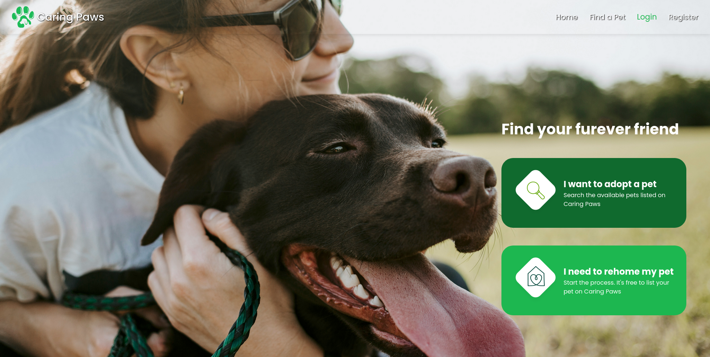

#  Caring Paws

A web application dedicated to connecting adorable, adoptable dogs with loving homes. We strive to make the adoption process transparent, easy, and joyful for both the dogs and their new families.




---

##  Features

* **🔍 Detailed Search & Filtering:** Users can easily find their perfect companion by searchin by breed, age, size and location.
* **🐶 Dog Profiles:** Each dog has a dedicated profile with photos, a biography, and description.
* **👤 User Authentication:** Secure sign-up and login for adopters and administrative accounts.


---

## ⚙️ Technologies Used

This project is built using the **MERN stack** (MongoDB, Express.js, React, Node.js), leveraging cloud hosting services for deployment.

| Layer | Technology | Description |
| :--- | :--- | :--- |
| **Frontend** | **React** | The main JavaScript library for building the dynamic user interface. |
| **Backend** | **Express.js** (with Node.js) | The server-side framework for handling routing, authentication, and API logic. |
| **Database** | **MongoDB Atlas** | The cloud-hosted NoSQL database for flexible and scalable data storage. |
| **Hosting** | **Netlify** (Client) & **Render** (Server) | Platforms used for continuous deployment and hosting of the application. |
| **Styling** | **[e.g., Tailwind CSS, Styled Components]** | *[Specify your styling library here]* |

---

### Deployment link

The latest stable version of **Caring Paws** is fully deployed and accessible:

* **Live Site (Frontend):** [https://caring-paws.netlify.app/]
* **Backend API Endpoint:** [https://carring-paws.onrender.com]

The following credentials can be used to try the app:
* **email:** johndoe@gmail.com
* **password:** 12345asd


### Installation Steps


#### Prerequisites

You'll need the following installed:
* **Node.js** 
* **npm** 
* **Git**


1.  **Clone the Repository:**
    ```bash
    git clone [https://github.com/](https://github.com/)[YourUsername]/CaringPaws.git
    cd CaringPaws
    ```

2.  **Backend Setup (Server):**
    a. Navigate to the server directory and install dependencies:
       ```bash
       cd server
       npm install
       ```
    b. **Setup Environment Variables:** Create a file named **`.env`** in the **`server`** directory. This file is excluded from GitHub for security. You must insert your personal MongoDB Atlas Connection URI and a secure JWT Secret key.
       ```
       # server/.env structure (Do NOT commit your actual values)
       PORT=5000
       MONGO_URI='mongodb+srv://[username]:[password]@[cluster-name].mongodb.net/CaringPawsDB?retryWrites=true&w=majority'
       JWT_SECRET=[your_secure_jwt_secret]
       ```
    c. Run the Express server:
       ```bash
       npm start
       cd .. # Return to root
       ```

3.  **Frontend Setup (Client):**
    a. Navigate to the client directory and install dependencies:
       ```bash
       cd client
       npm install
       ```
    b. Run the React development server:
       ```bash
       npm start
       ```
    The React application will open in your browser (typically `http://localhost:3000`), using a proxy configuration to communicate with your local Express server (usually on port 5000).
---
##  Future Improvements


#### 1. User Dashboard:
#### 2. Responsive Design: Mobile Optimization 
#### 3. Comments on Dogs
